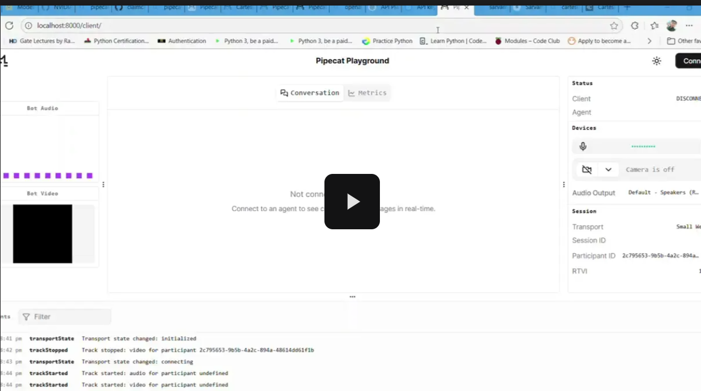

# claimcall-ai-voicebot

## 📹 Demo

The project implements an AI conversation agent that handles voice-based interactions in a healthcare collection scenario. It follows the classic pipeline of Speech-to-Text (STT) → Language Model (LLM) → Text-to-Speech (TTS) to process spoken queries and generate spoken responses.
In practice, a user speaks to the system (captured via a browser or phone), the audio is streamed over WebRTC, a VAD (voice activity detector) segments the speech, and an STT model transcribes the speech to text. This text is then passed into a large language model (e.g. OpenAI’s GPT) which produces a text reply, and finally a TTS engine synthesizes that reply back into audio. Pipecat – an open-source Python framework – orchestrates this real-time audio/AI flow. In healthcare contexts, such voice agents are used for tasks like patient payment reminders and overdue insurance clarifications, demonstrating the relevance of this demo system.

### System Architecture and Pipeline
- **Audio Streaming (WebRTC):** Real-time bidirectional audio transport via WebRTC enables low-latency communication between user and server. The browser or client sends live audio to the Pipecat backend in real time.
- **Voice Activity Detection (VAD):** A VAD (e.g. Silero VAD) monitors the stream and flags when the user starts or stops speaking. This lets the system trim silence and process only the spoken segments.
- **Speech-to-Text (ASR):** Each detected speech segment is converted to text by a speech recognition model. We evaluated NVIDIA Riva for ASR – Riva is a production-ready suite of ASR/TTS services praised for high accuracy. Pipecat also supports providers like AssemblyAI, Google, AWS, Cartesia, OpenAI, etc.
- **Large Language Model:** The transcribed text is sent to an LLM (e.g. OpenAI’s GPT-4). The LLM interprets the user’s query and any contextual history to generate an appropriate response. We used the OpenAI API as the LLM backend.
- **Text-to-Speech (TTS):** The LLM’s text reply is fed into a TTS engine to synthesize audio. We tested ElevenLabs, NVIDIA Riva TTS, and Cartesia. ElevenLabs stood out for naturalness – it offers thousands of voices in 70+ languages with superior realism. Pipecat supports ElevenLabs, Riva, Cartesia and others for TTS. For example, ElevenLabs can clone voices in seconds and has minimal latency (≈75 ms).
- **Audio Playback:** The synthesized speech audio is then streamed back to the user over WebRTC and played through their speaker, completing the conversational turn.

This cascaded voice AI pipeline (STT→LLM→TTS) is a well-established design. In fact, a Pipecat example in AWS’s reference architectures precisely uses this sequence (WebRTC → VAD → ASR → LLM → TTS) to handle voice queries. We followed this model closely: each component is modular, allowing us to plug in different ASR or TTS services as needed.